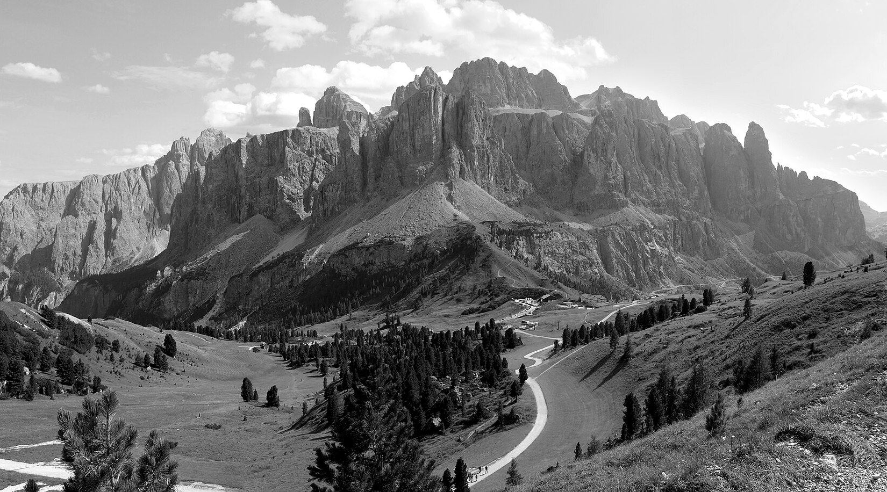
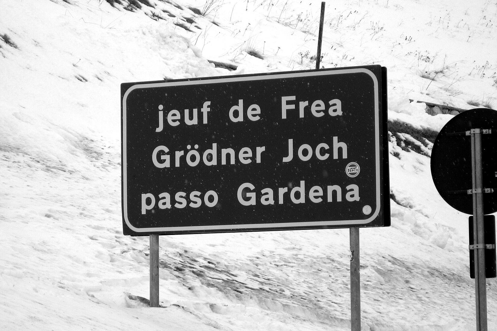
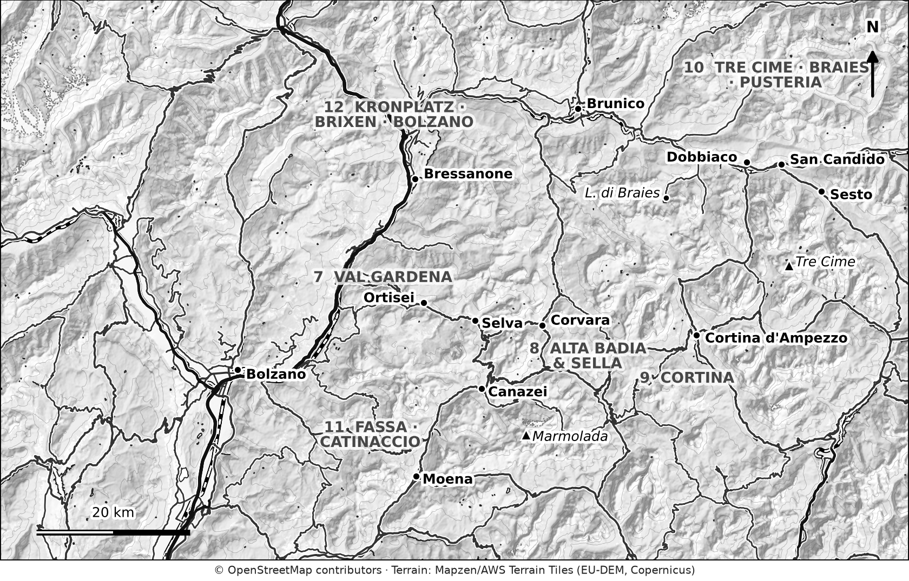

# PART 1: PLAN YOUR TRIP

# 1. How the Dolomites Work

<!-- FIG:C01a -->

*Figure 1.1. The Sella group above the Passo Gardena road.*
<!-- /FIG -->

The Dolomites are not a single resort or park. They are a large mountain region with many valleys, three main languages, several tourist boards and no single ticket that covers everything. That is why first-time visitors often feel lost when they start planning.

This chapter gives you the picture you need before you book anything. By the end, you will know where the main regions are, what each is best for, and how to match a region to your trip.

## What and where the Dolomites are

The Dolomites are a group of limestone mountains in north-east Italy. The rock is dolomite, which gives the peaks their pale colour and their steep, castle-like walls. The highest peak is the Marmolada at 3,343 metres. UNESCO added nine mountain groups to the World Heritage List in 2009.

The area sits across several Italian provinces. For a visitor, three matter most:

- **South Tyrol (Alto Adige / Südtirol).** A self-governing province where most people speak German and Italian. Val Gardena, Alta Badia, Sesto and Braies are here. Public transport and tourist services are well organised.
- **Trentino.** The Val di Fassa and the Catinaccio (Rosengarten) area. Italian is the main language, with Ladin in Fassa.
- **Veneto (province of Belluno).** Cortina d'Ampezzo and the Cinque Torri area, and the Auronzo side of the Tre Cime.

**Why this matters to you.** Each province runs its own transport, lift passes, tourist office and booking systems. A ticket bought in one area often does not work in another. You will need to check each area's official site.

## Three languages, many names

<!-- FIG:C01b -->

*Figure 1.2. The Passo Gardena sign gives the pass name in Ladin, German and Italian.*
<!-- /FIG -->

Almost every place has two or three names. Road signs show them together, but maps, booking sites and hotel emails may use only one.

| Italian | German | Ladin |
|---|---|---|
| Ortisei | St. Ulrich | Urtijëi |
| Val Gardena | Gröden | Gherdëina |
| Alpe di Siusi | Seiser Alm | Mont Sëuc |
| Lago di Braies | Pragser Wildsee | Lec de Braies |

Other places you will meet under two names:

| Italian | German |
|---|---|
| Tre Cime di Lavaredo | Drei Zinnen |
| Bolzano | Bozen |
| Bressanone | Brixen |
| Dobbiaco | Toblach |
| San Candido | Innichen |

**Tip:** Save both the Italian and German names of your destinations in your phone. When a booking page or bus timetable gives only one, you will still recognise it.

This guide uses the name you are most likely to see on a map or website, and gives the others on first mention.

## The regions in one view

<!-- FIG:M01 -->

*Figure 1.3. The Dolomites at a glance. The numbers on the map are the chapters that cover each area.*
<!-- /FIG -->

This book groups the Dolomites into six areas. Each has its own chapter.

| Area | Best for | Main bases | Car needed? |
|---|---|---|---|
| **Val Gardena and Alpe di Siusi** (Ch. 7) | Seceda, wide meadows, first-timers, families | Ortisei, Santa Cristina, Selva | Helpful, not essential |
| **Alta Badia and Sella Ronda** (Ch. 8) | Mountain passes, cycling, food, the ski circuit | Corvara, La Villa, San Cassiano | Helpful |
| **Cortina and its mountains** (Ch. 9) | Great War sites, big scenery, glamour | Cortina d'Ampezzo | Helpful; no train |
| **Tre Cime, Sesto, Braies and Pusteria** (Ch. 10) | The Tre Cime loop, Lago di Braies, valley train | Sesto, Dobbiaco, San Candido | Helpful; train on the valley line |
| **Val di Fassa and Catinaccio** (Ch. 11) | Rosengarten, Marmolada, good value | Canazei, Campitello, Moena | Helpful |
| **Plan de Corones, Brixen and Bolzano** (Ch. 12) | Rainy days, museums, wine, low season | Bolzano, Brixen, Brunico | Not needed |

## How a Dolomites trip differs from other Alpine trips

If you have visited the Swiss or Austrian Alps, expect these differences:

- **Lifts are the doorway to the high country.** Most famous walks start at the top of a cable car, not in the valley. Lift opening dates and prices shape your trip.
- **Mountain huts (rifugi) serve proper meals.** You can plan a day around a lunch stop at 2,000 metres or more. Many also offer overnight stays.
- **The roads are the sights.** The high passes, such as Gardena, Sella, Pordoi and Falzarego, are scenic drives in their own right. They are also narrow, busy and subject to local rules.
- **The seasons are short and sharp.** Many lifts and huts run for around four months in summer. Out of season, a lot is closed.
- **Booking systems are new and still changing.** The most famous places have introduced limits in the mid-2020s. Rules change each year.

## Who this guide suits

| If you are... | Start with |
|---|---|
| A first-time visitor with a week | Val Gardena or Alta Badia as a base; Chapter 18, 7-day plan |
| A family with children | Alpe di Siusi, Val Gardena, Fassa; Chapter 14 |
| A keen hiker | Chapters 10, 11 and 13 |
| A driver who loves mountain roads | Chapter 8 |
| Travelling without a car | Chapters 4, 12 and 18 (car-free plan) |
| A skier or snowboarder | Chapter 15 |
| Visiting in a rainy week | Chapter 12 |

## How long to stay

- **3 days:** one region, one base. Do not try to cover two.
- **5 to 7 days:** one or two regions. This is the sweet spot for first-time visitors.
- **10 days or more:** three regions with two bases, or a hut-to-hut route.

> **Wish I'd Known:** Moving base every night wastes time. A drive between regions can take one to two hours or more, and the last hour of any trip is often the slowest. Two or three nights per base is a good minimum.

## The downsides

A guide should tell you the downsides, too:

- **Crowds.** The best-known places are busy from mid-morning in July and August.
- **Cost.** Lifts, parking and hut meals add up. Chapter 5 shows the real numbers.
- **Planning effort.** Booking rules mean you cannot decide everything on the day.
- **Weather.** Rain and cloud can hide the views for days. Plan a flexible day.

None of these should put you off. They are the reasons to plan well.

## Planning mistakes to avoid

- Choosing a base because of one famous photo, then finding it is two hours from the rest of your list.
- Treating the Dolomites as one place with one pass.
- Planning only the sights and ignoring lift days, closures and booking dates.

## What to do next

1. Choose your travel dates (Chapter 2).
2. Check the booking rules for your must-see places (Chapter 3).
3. Decide how you will arrive and move around (Chapter 4).
