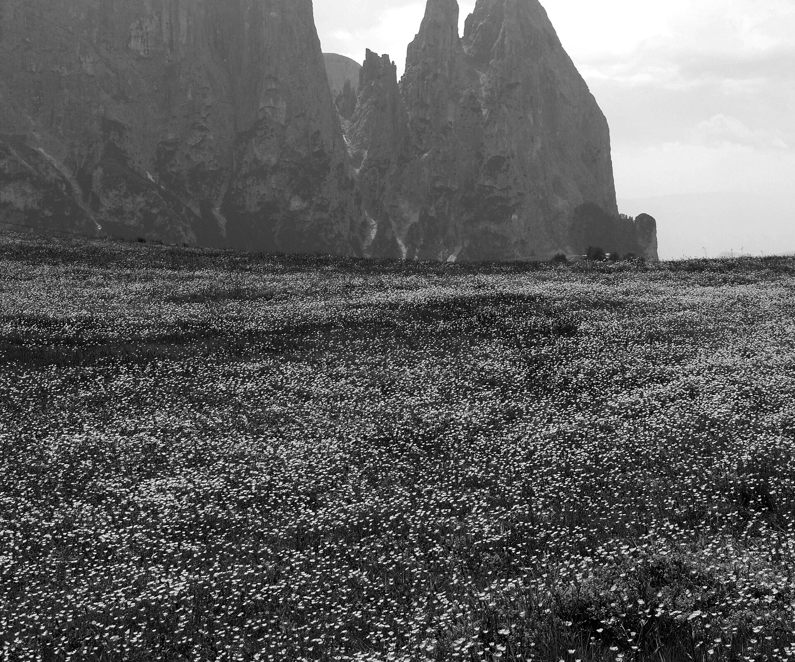
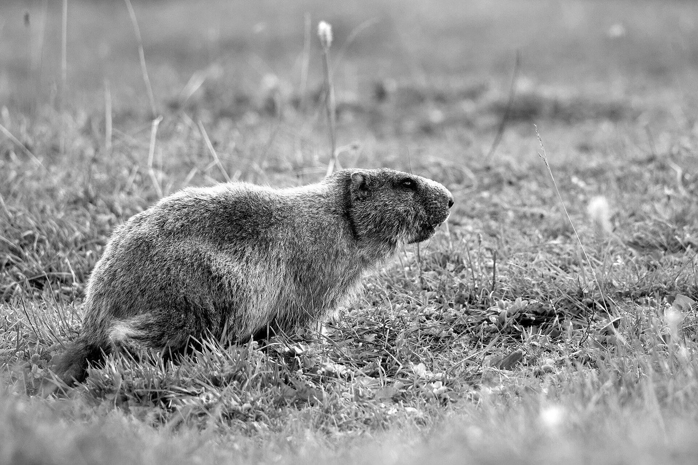
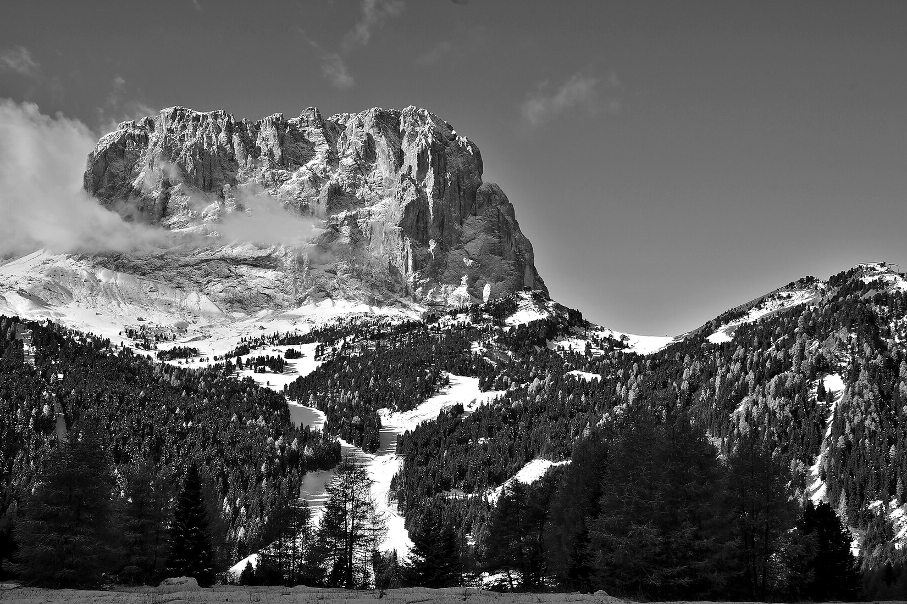
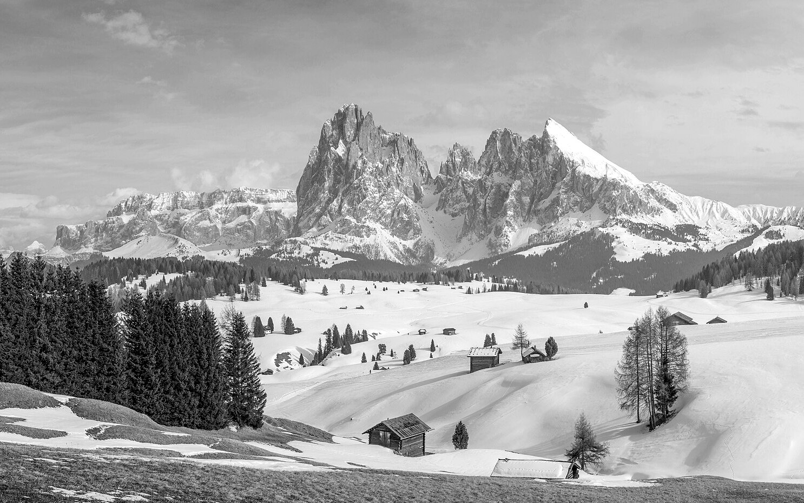
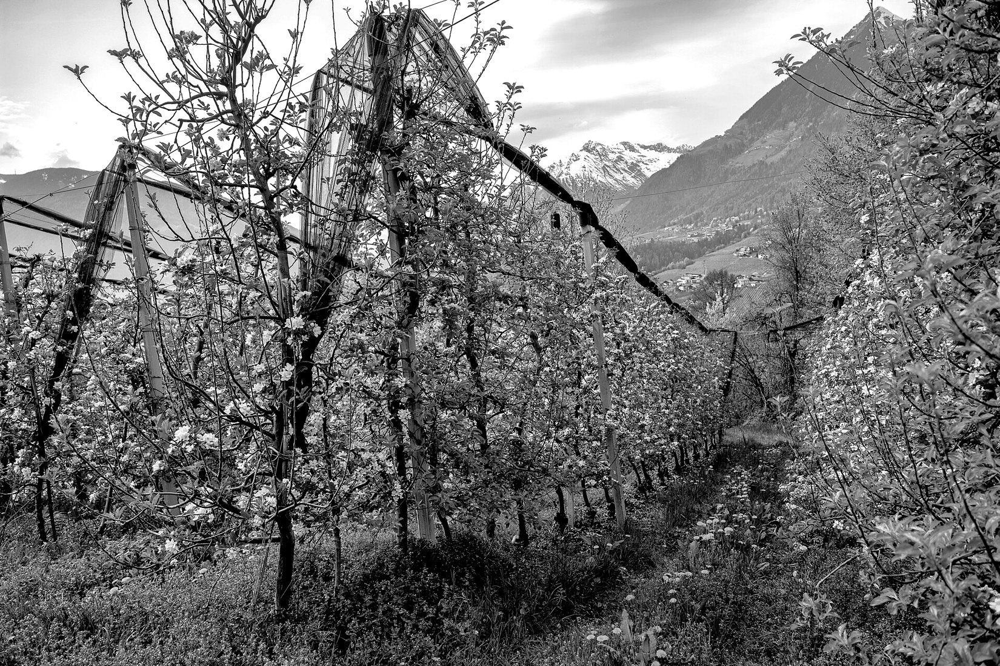

# 2. When to Go: Season by Season

The best time to visit depends on what you want to do. Walkers need open lifts and snow-free trails. Skiers need snow. Drivers need open passes. Photographers want good light. Each season gives you some of these and takes others away.

The most important fact in this chapter: **the walking season is short, and dates change every year.** Plan around the dates the operators publish, not around a fixed calendar.

## The short answer

| If you want... | Go in... |
|---|---|
| Best overall balance of weather, open lifts and smaller crowds | **Early to mid-September** |
| Long days, flowers and the earliest high-trail access | Late June to mid-July |
| Reliable hiking weather, with peak crowds and prices | Mid-July to August |
| Gold larches, quiet villages and lower prices | Late September to October (lower-level walks only) |
| Skiing | Mid-January to mid-March for the best snow cover |
| Christmas markets and a festive feel | Late November to early January |
| Museums, wine and cities, with few crowds | April to mid-May |

## Summer: late June to mid-September

<!-- FIG:C02s -->

*Figure 2.1. A summer meadow of buttercups on the Alpe di Siusi, with the Sciliar rocks behind.*
<!-- /FIG -->

Summer is the main walking season. Lifts run, huts are open and high trails are mostly free of snow.

| | |
|---|---|
| **Weather** | Warm valleys, cool mountains. Expect daytime highs of about 20–28 °C in the valleys, and it gets about 6 °C cooler for every 1,000 metres you climb. Afternoon thunderstorms are common in July and August. |
| **Advantages** | Everything is open. Long days. The widest choice of hikes, huts, lifts, bike routes and via ferrate. |
| **Drawbacks** | Crowds, parking pressure and the booking rules in Chapter 3. Highest prices of the year. |
| **Crowds** | High from July to August. The week of 15 August (Ferragosto, an Italian public holiday) is among the busiest. |
| **Prices** | Highest from mid-July through August. Better in late June and in September. |
| **Roads and passes** | Mountain passes are open. Cyclists and motorbikes are common, so allow extra time. |
| **Wildlife** | Marmots, chamois and red deer are all possible. Early morning gives the best chance. |
| **Photography** | Meadow flowers peak in June and early July. Haze and midday glare are common in August. Early and late light are best. |
| **Activities** | All of them. |
| **Best for** | Walkers, families, drivers, and anyone who wants the full range. |

**Late June to early July.** Meadows are in flower, and days are long. Patches of old snow can remain on shaded high routes. Some lifts and huts open a little later in the season, so check dates.

**July and August.** This is the warmest and busiest time. Start every walk early. Many visitors aim to finish by early afternoon to avoid storms.

**Early to mid-September.** Many experienced visitors rate this as the best window. The weather is often settled, the air is clear, crowds drop, and prices ease. Huts start to close in the second half of the month, and the Lago di Braies car restrictions ended on 15 September in 2026.

> **Wish I'd Known:** September is popular for good reason, but it is not risk-free. In 2026, the Gardena Card and the Val di Fassa Panorama Pass both ran until 11 October. Individual lifts and huts can close earlier than the passes that cover them, so check the closing date of each one you plan to use.

<!-- FIG:C02m -->

*Figure 2.2. An alpine marmot at Cianpo de Crósc, in the Dolomiti d'Ampezzo nature park near Cortina d'Ampezzo.*
<!-- /FIG -->

## Autumn: late September to October

<!-- FIG:C02a -->

*Figure 2.3. Golden larches below the Sassolungo in late autumn, with the first snow on the peaks.*
<!-- /FIG -->

| | |
|---|---|
| **Weather** | Often clear and crisp, but colder and less predictable. Early snow can fall at altitude from October. |
| **Advantages** | Gold larches, low prices, quiet trails and the red deer rut (the "roaring" season). |
| **Drawbacks** | Many lifts and high huts close from late September or early October. Some valleys effectively close for a few weeks before winter. Days are short. |
| **Crowds** | Low. |
| **Prices** | Low, with some hotels closed. |
| **Roads and passes** | Open, but early snow can close high roads for a short time. Check before you drive. |
| **Wildlife** | Deer are active. Marmots go into hibernation from about October. |
| **Photography** | Golden larches usually peak in mid to late October at mid elevations. Low sun gives warm light. |
| **Activities** | Low and mid-level walks, scenic drives, wine and food. |
| **Best for** | Photographers, couples, and anyone who wants quiet. |

**A local tradition worth planning around.** In South Tyrol, *Törggelen* is the autumn custom of eating hearty farm food with new wine and roasted chestnuts at farm inns. It runs from around October into November. Many places need a reservation.

## Winter: December to March

<!-- FIG:C02w -->

*Figure 2.4. Winter on the Alpe di Siusi, with the Sassolungo group in the distance.*
<!-- /FIG -->

| | |
|---|---|
| **Weather** | Cold, with reliable snow from January. Valleys can be sunny and dry while the mountains are snow-covered. |
| **Advantages** | World-class skiing across the linked Dolomiti Superski area. Christmas markets. Spas. |
| **Drawbacks** | High prices at peak times. Short days. Winter driving rules. Many summer walks and passes are unavailable. |
| **Crowds** | High at Christmas and New Year, February school holidays and Easter. |
| **Prices** | In 2026/27 the pricing calendar for Dolomiti Superski listed a low season from opening to 19 December, and a high season from 20 December to 14 March (reported; check the official site). |
| **Roads and passes** | Main roads are kept open. Winter tyres or chains are usually required (see Chapter 4). |
| **Wildlife** | Hard to see. |
| **Photography** | Snow-covered peaks, alpenglow and village lights. Cold drains camera batteries quickly. |
| **Activities** | Skiing, snowboarding, ski touring, snowshoeing, sledding, markets and spas. |
| **Best for** | Skiers and snowboarders, families with school-age children, and festive-season travellers. |

Chapter 15 covers winter in detail. Christmas markets in Bolzano, Brixen and other towns usually run from late November to early January.

## Spring: April to mid-June

<!-- FIG:C02p -->

*Figure 2.5. Apple trees in blossom in an orchard near Merano, South Tyrol.*
<!-- /FIG -->

| | |
|---|---|
| **Weather** | Changeable. Snow lies at altitude into June. Valleys warm up quickly. |
| **Advantages** | The lowest prices, the fewest people, blossom in the valleys, and good conditions for towns and museums. |
| **Drawbacks** | Many lifts, huts and hotels are closed between the winter and summer seasons. High trails are snowy or muddy. |
| **Crowds** | Very low. |
| **Prices** | Low. |
| **Roads and passes** | Main passes are usually open. Some secondary roads open only after snow is cleared. Check live road information. |
| **Wildlife** | Marmots come out of hibernation. Birds are active. |
| **Photography** | Blossom in the valleys, snow on the peaks. |
| **Activities** | Valley and low-level walks, cycling in the valleys, cities, wine villages and museums. |
| **Best for** | Culture, food and wine, budget travellers, and flexible visitors. |

South Tyrol's apple orchards usually blossom in April around Bolzano and the Adige valley.

> **Wish I'd Known:** In April, May and early November, a surprising number of hotels, restaurants and lifts are shut. Check each place you want before booking. For example, the Alpe di Siusi road is open to cars all day in mid-April to mid-May and again from early November to early December (2026 dates), outside the summer restrictions.

## Summer calendar: what opened and closed in 2026

Use this as a guide to the likely pattern in 2027. The 2027 dates will be announced in the spring.

| Operator or place | 2026 dates |
|---|---|
| Seceda lifts (Ortisei) | 22 May – 2 November |
| Alpe di Siusi cable car | 22 May – 2 November |
| Dolomiti SuperSummer card | 14 May – 8 November |
| Gardena Card | 6 June – 11 October |
| Val di Fassa Panorama Pass | 30 May – 11 October |
| Tre Cime toll road | Opened around 23 May; open to late October, weather permitting |
| Messner Mountain Museum Corones | 16 May – 8 November |
| Lago di Braies car restrictions | 1 July – 15 September |
| Alpe di Siusi road | Cars restricted 09:00–17:00 in the main season; open all day mid-April to mid-May and early November to early December |

## Month-by-month planner (June to October)

| Month | Walking | Lifts and huts | Crowds | Notes |
|---|---|---|---|---|
| **June** | Good at low and mid levels; some snow high up | Opening in stages | Low to medium | Flowers and long days |
| **July** | Very good | Open | High | Afternoon storms |
| **August** | Very good | Open | Highest | Book everything ahead |
| **September** | Excellent | Open, closing late in the month | Medium to low | Often the best weather |
| **October** | Low and mid levels only | Most closed from early October | Low | Larches; some places shut |

## Events that will change your 2027 trip

Dates come from event organisers and may change. Confirm before you plan around them.

| Event | 2027 date (reported) | What it means for you |
|---|---|---|
| Sellaronda Bike Day | Saturday 5 June, 09:00–16:00 | Roads around the Sella group are closed to cars. Plan around it if you plan to drive the passes that day. |
| Lavaredo Ultra Trail | 23–27 June, Cortina | Busy town. Book early. |
| Maratona dles Dolomites | Race day Sunday 4 July (event days 1–4 July) | Alta Badia is very busy, with road closures on race day. |
| Alpe di Siusi Half Marathon | 4 July | Local road and trail disruption |
| Biathlon World Cup, Anterselva | 14–17 January | Busy area; book early |

> **Wish I'd Known:** Big events fill hotels months ahead and close roads on the day. They can also be a highlight. Decide in advance whether you want to join the crowd or avoid it.

## How to plan around weather

The Dolomites have changeable mountain weather. These habits help.

1. **Plan the big walk for the morning.** Clear skies often turn to cloud and storms by mid-afternoon in summer.
2. **Keep one flexible day** in a trip of five days or more. Put your highest-view walk there.
3. **Check more than one forecast** the evening before and again in the morning. Use the local services: the South Tyrol weather service, Meteotrentino for Trentino, and the regional weather agency for Veneto. Mountain forecasts differ from valley forecasts.
4. **Have a plan B** for every day: a museum, a lake walk, a lower route or a cable car ride.
5. **Know the thunderstorm rule.** If thunder is near, leave ridges, summits and cable lines and move to a hut or lower ground. Chapter 19 covers this.

## What to do next

1. Choose your travel window with the table at the top of this chapter.
2. Check that the lifts and huts you want are open on your dates.
3. Move on to Chapter 3 to see what you must book, and when.
