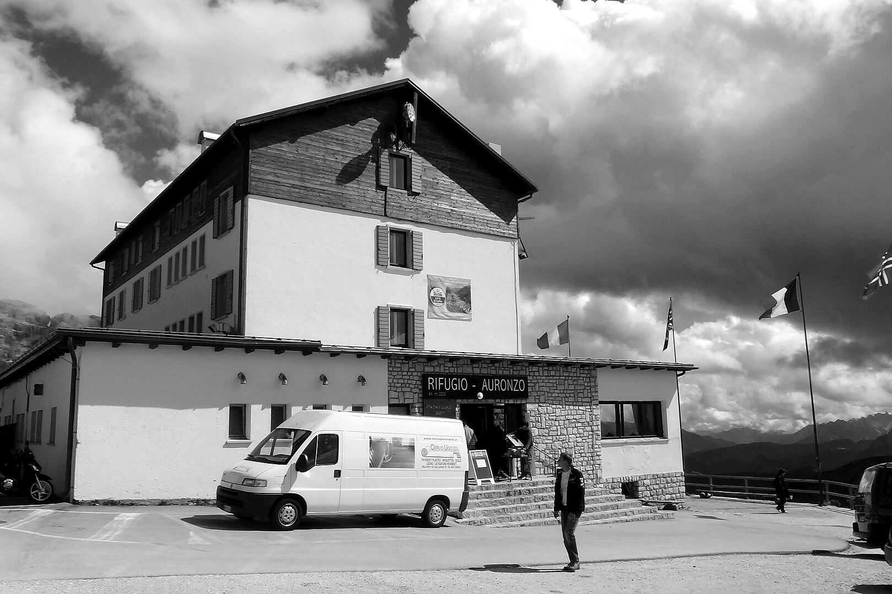

# 5. What It Really Costs

The Dolomites are not a budget destination, but they do not have to be a shock. Most overspending comes from costs that visitors did not expect: parking, lift tickets, tourist tax and half-board hotels with drinks extra.

This chapter shows realistic daily budgets for three types of traveller, explains each cost, and tells you where to save and where to spend.

> **How to read the numbers.** All prices are **2026** figures, in euros, **per person per day**, for summer travel, with two people sharing a room. They do not include flights. They are planning estimates built from published 2026 prices and typical ranges, so treat them as a guide of about plus or minus 20 percent. Check current prices before you book.

## Daily budgets at a glance

| Per person per day | Budget | Mid-range | Luxury |
|---|---|---|---|
| **Accommodation** | €45–80 | €60–110 | €150–300 (half board) |
| **Food and drink** | €25–40 | €45–75 | €30–80 (extra to half board) |
| **Local transport** | €5–20 | €15–45 | €30–100 |
| **Lifts and activities** | €10–30 | €30–65 | €50–150 |
| **Typical total** | **about €85–170** | **about €150–295** | **about €260–630** |

**Peak weeks (mid-July to August, Christmas, February) sit at the top of each range or above it.** Late June and September sit lower.

## What each traveller gets

**Budget traveller.** Guesthouse, simple hotel, hostel bed, farm stay, apartment or a hut dorm. Supermarket breakfasts and picnic lunches. Buses with a Mobilcard or guest pass. One paid lift a day at most, and free walks the rest of the time.

**Mid-range traveller.** A 3- or 4-star hotel with breakfast or half board. A hut lunch most days and a sit-down dinner. A mix of public transport and a rental car. A lift card or a few single tickets.

**Luxury traveller.** A 4- or 5-star hotel with half board, spa and views. Fine dining at least once. Private transfers or a rental car. Private guides and the best lifts.

## Accommodation costs

| Type | 2026 price guide |
|---|---|
| **Mountain hut, half board** (dinner and breakfast) | about €60–110 per person per night |
| **3-star hotel, half board, Ortisei** | from about €59–114 per person per night (varies by date) |
| **Mid-range hotel, room only** | about €90–180 per room per night, with peak weeks above this |
| **4-star hotel, half board, Ortisei (one example)** | €146–278 per person per day in summer 2026; the top price covered 8–22 August |
| **Cortina d'Ampezzo** | some July doubles at about €110–130; the area average was closer to €200 |

**Tourist tax.** South Tyrol raised its tourist tax in 2025. The published rate is €3.00 per person per night in 4- and 5-star places, €2.50 in 3-star places and €2.00 elsewhere, with a daily €1.50 charge for dogs from 2026. One Ortisei hotel listed a higher charge of €5 for guests aged 14 and over. Cortina and other Veneto towns near the Olympic venues could charge up to €5. Ask your host what applies.

**Half board explained.** In many Dolomites hotels, "half board" (*mezza pensione*) includes breakfast and a multi-course dinner. Drinks cost extra. It can be good value, but if you want to eat at a hut or in another village, choose breakfast only.

## Food and drink

<!-- FIG:C05a -->

*Figure 5.1. Rifugio Auronzo at 2,333 m, reached by the Tre Cime toll road.*
<!-- /FIG -->

| Item | Typical price |
|---|---|
| Cappuccino | about €2.20 on average in Bolzano, up to €2.50 (more on mountain terraces) |
| Plate of canederli (dumplings) at a festival | about €8 |
| Typical lunch | about €20 per person |
| Typical dinner | about €40 per person |
| Set lunch at a high-mountain hut (one example) | about €40 per person |
| Dinner at a mountain hut | about €30–120 per person depending on the hut and style |

Hut menus usually list starters, mains and desserts separately, and drinks cost extra. Mountain prices are higher than valley prices because supplies are brought up by lift or helicopter.

**Saving on food.** Eat your main meal at lunch, when many places offer a daily set menu. Buy picnic food in valley supermarkets before you go up. Share large portions at huts.

## Transport costs

| Item | Typical price |
|---|---|
| Südtirol Mobilcard | about €20–22 (1 day), €30–32 (3 days), €50–52 (7 days) |
| Rental car (Venice airport, average) | about €91 per day; automatics cost 20–30% more |
| Fuel | about €2.00 per litre petrol, €2.12 diesel (August 2026) |
| Airport bus, Val Gardena to Bolzano airport | about €7–8 one way |
| Cortina Express (Venice to Cortina) | about €21 one way |
| Local taxis and transfers | €20–60 per day if used regularly (blog estimate) |

## Lifts, tickets and activities

| Item | 2026 price |
|---|---|
| Seceda lifts, Ortisei round trip | €74 adult, €37 junior |
| Alpe di Siusi cable car | about €30 adult round trip |
| Dolomiti SuperSummer, 1 day | €67 |
| Gardena Card, 3 days | €124 |
| Val di Fassa Panorama Pass, 3 of 6 days | €83 |
| Lagazuoi cable car | about €30 |
| Cinque Torri chairlift | about €15 |
| Messner Mountain Museum Corones | €14 adult |
| Tre Cime toll road | €40 per car |

## Hidden costs

These are the extras that catch visitors out.

- **Parking.** Alpe di Siusi P2 Compatsch €30 a day; P1 Spitzbühl €15 a day. Lago di Braies lakeside P4 €40. Lago di Carezza €3 an hour, up to €30 a day.
- **Tourist tax.** About €2–3 a night per person in most places, more in some.
- **Lift tickets for extras.** Bikes €7 and dogs €7 on the Seceda lifts.
- **Drinks at huts and with half board.**
- **Cover charge.** A few restaurants add a *coperto* or service charge. Check the menu.
- **Cash.** Some huts do not take cards. Carry some euros.
- **Fines.** ZTL and parking fines can arrive months after you return.
- **Mountain rescue.** Not free in every case. Insurance should cover at least €10,000 (Chapter 19).

## Where spending more is worth it

- **A room in a well-connected village.** It can save parking fees, driving time and stress.
- **A guide for via ferrata or glacier days.** It is a safety and learning investment.
- **Lifts on your best-weather day.** Pay for the one that gives you the best view.
- **Travel insurance with mountain rescue cover.**
- **One memorable hut dinner or night.** It adds more than another hotel upgrade.

## Where spending more is unnecessary

- **A bigger car.** A compact car is easier on narrow roads and in tight parking.
- **Half board every night,** if you plan to eat out.
- **A multi-day lift card you will not fully use.** Count your lifts first.
- **Paid transport to places you can walk to.**
- **The highest-priced week.** Moving your trip by a week often cuts the bill without changing the weather much.

## Money-saving strategies

1. **Travel in late June or September.** Prices and crowds both drop.
2. **Ask for a guest pass** from your hotel for free regional transport (where offered).
3. **Eat at lunch.** Many places charge less for set lunches than for dinner.
4. **Use free walks.** The Alpe di Siusi meadows, valley paths and lake loops cost nothing once you are there.
5. **Compare cards against single tickets** before you buy.
6. **Stay in a valley base** and use buses to reach the high points.
7. **Share costs** for a rental car and apartment among three or four people.

## Sample 7-day budgets for two travellers (summer, excluding flights)

| Style | Estimated total for two |
|---|---|
| **Budget** | about €1,200–2,400 |
| **Mid-range** | about €2,100–4,100 |
| **Luxury** | about €3,600–8,800 |

*Calculated as the daily totals above, for two people over seven days, rounded. Add flights, rental car, parking and insurance if not already counted.*

## Winter costs

Winter prices differ, mainly because of the ski pass. The 2026/27 pricing calendar for Dolomiti Superski was reported to run a high season from 20 December to 14 March. Chapter 15 covers ski passes in detail, and you should check the official site for the 2026/27 prices.

## Common mistakes

- Booking a half-board hotel and then eating out most nights.
- Buying a card that does not include your key lift.
- Forgetting parking costs at popular trailheads.
- Driving to a destination that has a free or cheap shuttle.
- Relying on cards only in the high mountains.

## What to do next

1. Choose your budget level and compare it with the table at the start of this chapter.
2. Move to Chapter 6 to pick a base that fits that budget.
