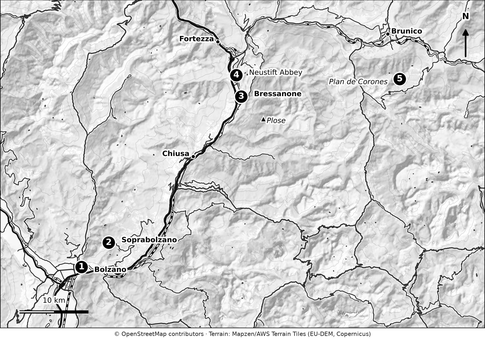
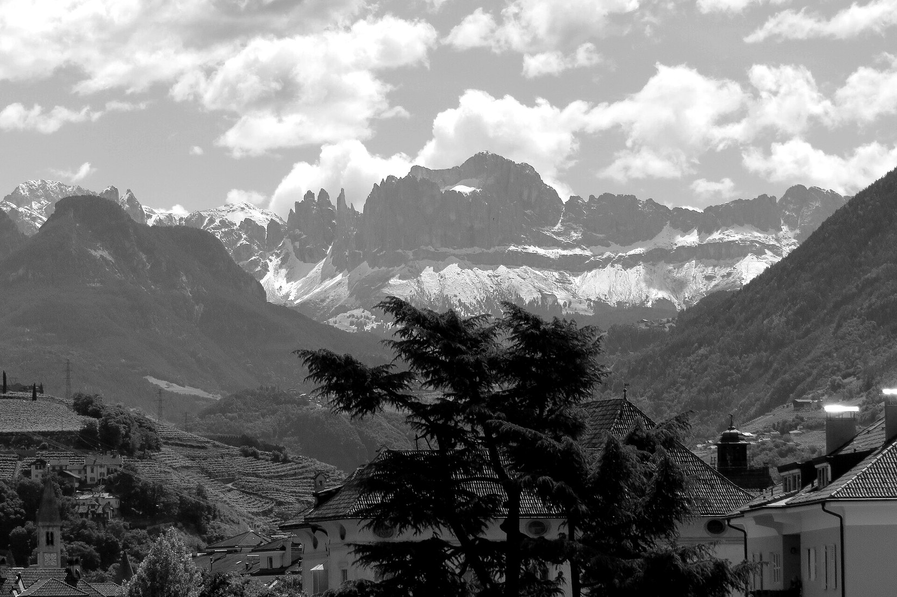
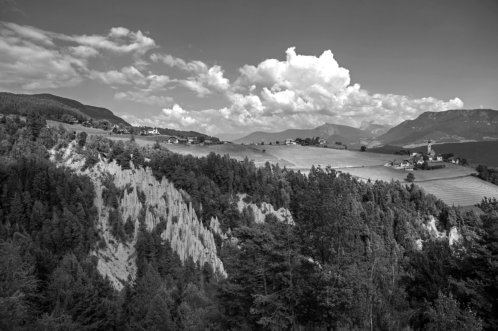
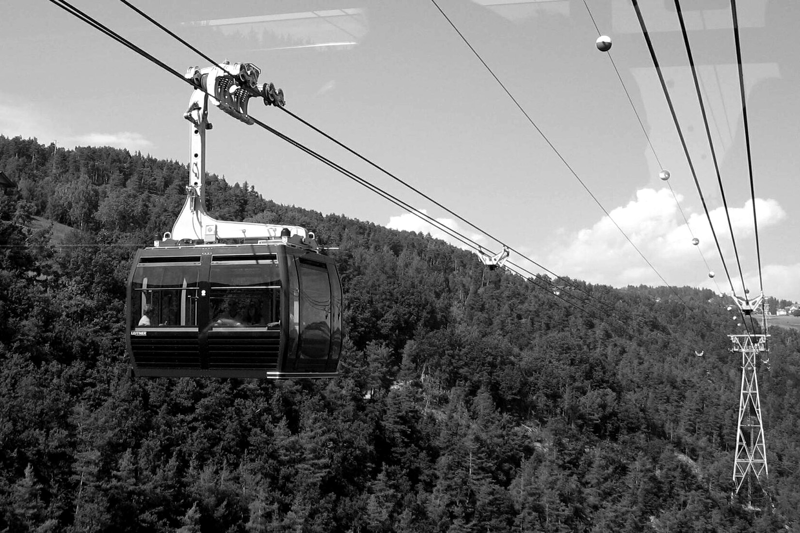
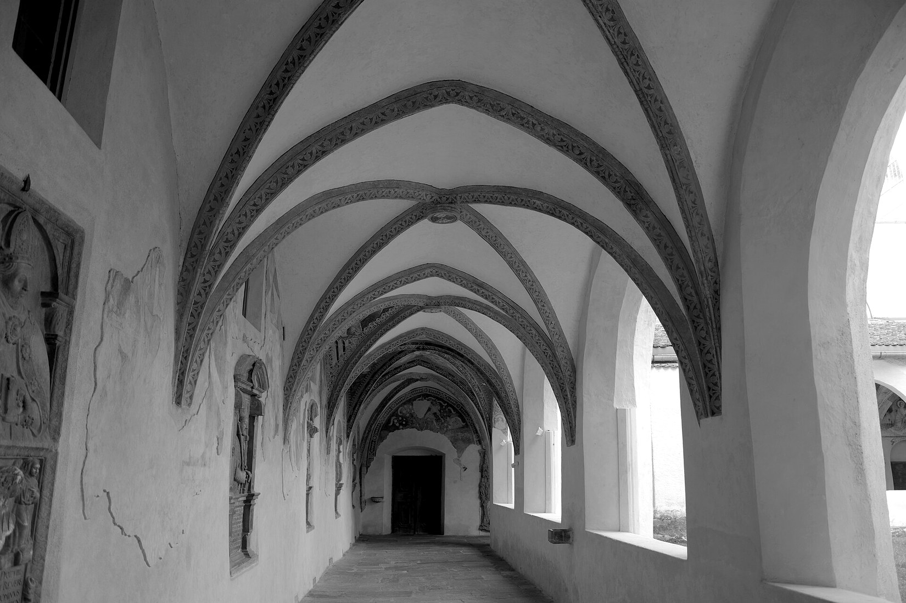
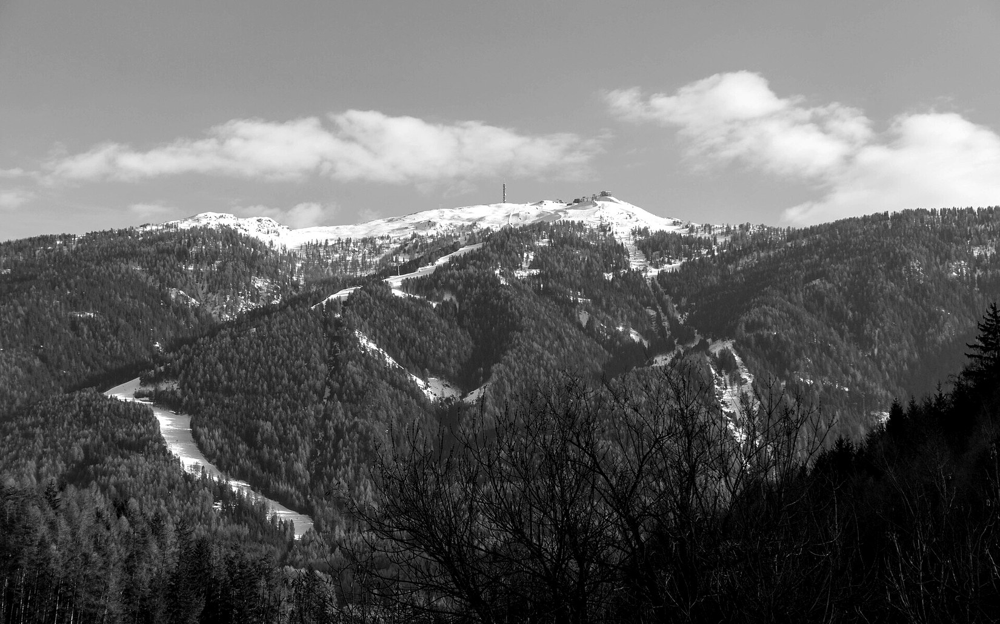

# 12. Plan de Corones, Brixen and Bolzano

Not every Dolomites day is a mountain day. This chapter covers the places that suit rainy days, low season and car-free travel: the cities of Bolzano and Brixen, and the Plan de Corones (Kronplatz) summit with its mountain museum.

These places also work as bases. They are well served by trains and buses, and they are often cheaper than the big resorts.

## Overview

<!-- FIG:M08 -->

*Figure 12.1. Plan de Corones, Brixen and Bolzano. 1 Bolzano, 2 Soprabolzano (Renon), 3 Bressanone, 4 Neustift Abbey, 5 Plan de Corones.*
<!-- /FIG -->

| | |
|---|---|
| **Province** | South Tyrol |
| **Main bases** | Bolzano (Bozen), Brixen (Bressanone), Brunico (Bruneck) |
| **Language** | German and Italian |
| **Best for** | Rainy days, culture, wine, low season, car-free travel |
| **Car needed?** | No |
| **Nearest airports** | Bolzano (small airport); Innsbruck, Verona and Venice also work |
| **Season** | Cities year-round; Plan de Corones lifts late spring to autumn, then winter |

## Getting there and around

- **Trains.** Bolzano and Brixen are on the Brenner line. Brunico is on the Pusteria line. Regional trains and buses in South Tyrol are covered by the Südtirol Mobilcard (Chapter 4).
- **Renon (Ritten) cableway.** The Mobilcard also covers the Ritten cable car in 2026.
- **Buses.** Regional buses reach most villages. Services are less frequent on evenings and Sundays, so check times.

## 1. Bolzano and the Ötzi Museum

<!-- FIG:C12a -->

*Figure 12.2. Bolzano, with the Catinaccio (Rosengarten) group on the horizon.*
<!-- /FIG -->

| At a glance | |
|---|---|
| **Overview** | South Tyrol's capital, a city of arcades, markets and a strong café culture. Home to the South Tyrol Museum of Archaeology and Ötzi the Iceman, a glacier mummy more than 5,000 years old found in the nearby Alps. |
| **Why visit** | A rainy-day highlight and a good first or last stop. |
| **Cost (2026)** | Museum €13 adult, €10 reduced, €26 family ticket, free for children under 6. |
| **Opening hours** | Tuesday to Sunday all year. Open on Mondays in July, August and December. |
| **Visit time** | 1.5 to 2 hours for the museum. A half-day for the old town. |
| **Best time** | Any time. Quieter in spring and autumn. |
| **Crowd reality** | Busy in school holidays and in December. |
| **Practical tips** | Buy tickets online for peak weeks. Hot in July and August, so plan indoor visits for the middle of the day. |
| **Common mistakes** | Arriving on a Monday outside the summer and December exceptions. |
| **Drawbacks** | Far from high mountain scenery; summer heat. |

**More in Bolzano.** Walk the old town and the fruit market, ride the Renon cableway to Soprabolzano, and see the Earth Pyramids. The December Christmas market runs from late November to early January.

## 2. The Renon (Ritten) cableway and Earth Pyramids

<!-- FIG:C12d -->

*Figure 12.3. The earth pyramids of Renon (Ritten), with the plateau meadows and villages above them.*
<!-- /FIG -->

<!-- FIG:C12f -->

*Figure 12.4. A cabin of the Renon (Ritten) cableway above the forest on the climb from Bolzano.*
<!-- /FIG -->

- **Cableway.** About 4 km, roughly 12 minutes, from Bolzano to Soprabolzano. Covered by the Mobilcard in 2026.
- **Earth Pyramids.** Tall clay columns topped by boulders, near Soprabolzano. A short walk from the village paths.
- **Best for:** A half-day escape from city heat or a low-cloud day.

## 3. Brixen (Bressanone)

<!-- FIG:C12c -->

*Figure 12.5. The cloister of Neustift Abbey (Novacella) near Brixen, with its painted ribbed vaults.*
<!-- /FIG -->

| At a glance | |
|---|---|
| **Overview** | A compact, historic town on the Isarco river, with a cathedral, old streets and a good food scene. |
| **Why visit** | A calmer city than Bolzano, with easy bus links to the mountains. |
| **Cathedral tours (2026)** | Combined cathedral, cloister and baptistery tours about €5 per person (museum extra). |
| **Neustift Abbey (Novacella)** | An Augustinian monastery a short distance from town. Museum entry €4 (children up to 12 free). Includes vineyards and an archaeological trail. |
| **Visit time** | A half day for the town, another half day for the abbey. |
| **Best time** | Spring and autumn. Christmas market in December. |
| **Practical tips** | Combine the town and the abbey in one day by bus or bike. |
| **Common mistakes** | Planning too little time. |
| **Drawbacks** | Not a mountain base. |

## 4. Plan de Corones (Kronplatz) and the Messner Mountain Museum

<!-- FIG:C12e -->

*Figure 12.6. The Kronplatz (Plan de Corones) from the north, a broad ski mountain with the summit station on top.*
<!-- /FIG -->

| At a glance | |
|---|---|
| **Overview** | A rounded summit at 2,275 m above Brunico, reached by gondola. It is the site of the Messner Mountain Museum Corones, designed by Zaha Hadid and dedicated to traditional mountaineering. |
| **Why visit** | Panoramic views of many Dolomites groups, and a museum that works in good or poor weather. |
| **Access** | Gondola from Brunico or from villages around the mountain, such as Olang. |
| **Season (2026)** | 16 May to 8 November (summer), with the museum open 10:00 to 16:00. |
| **Cost (2026)** | Kronplatz day ticket €53 adult. Multi-day tickets €97 (2 days), €128 (3 of 4 days) and €162 (5 of 7 days). Season pass €325. Single tickets on the Kronplatz 2000 route €36 (up and down) or €25 (one way). The SuperSummer card is also valid (€67 for 1 day). Museum: €14 adult, €6 child (6 to 18), €12 student or senior, €32 family. |
| **Visit time** | 2 to 4 hours for the museum and views. Half a day with a walk. |
| **Best time** | Clear mornings. The view needs good visibility. |
| **Crowd reality** | Busy at midday in July and August. |
| **Difficulty** | Easy. |
| **Practical tips** | Check lift hours before you go. Layers: the summit is windy. |
| **Common mistakes** | Going up in thick cloud. |
| **Drawbacks** | The lift is pricey, and the summit is a managed area, not a wilderness. |

## 5. Wine villages and valley walks

South Tyrol has a long wine tradition, with vineyards south of Bolzano along the wine road. Local white and red wines are served in most restaurants. For a quiet day, take a train or bus south of Bolzano, walk between villages and stop in a wine cellar.

## Best things to do on a bad-weather day

| Activity | Where | Notes |
|---|---|---|
| Ötzi museum | Bolzano | Plan 1.5–2 hours |
| Neustift Abbey | Brixen | €4 museum entry (2026) |
| Messner Mountain Museum Corones | Plan de Corones | Good in poor weather if the lift runs |
| Old-town walk and café stop | Bolzano or Brixen | Free |
| Spa day | Most hotels and towns | Check day-pass prices |

## Where to stay

**Bolzano** works for a car-free trip with day excursions by bus and train. **Brixen** is calmer and good for culture and wine. **Brunico** is a base for Plan de Corones and cycling. See Chapter 6.

## Where to eat

South Tyrolean cuisine is a mix of Austrian and Italian. Look for dumplings, soups, speck and strudel in town inns. In autumn, farm inns offer *Törggelen* (Chapter 2). Book dinners at popular places in December and on weekends.

## Photography notes

- Bolzano's arcades and markets in soft light.
- The view from Plan de Corones in clear morning light.
- Neustift Abbey from the vineyard trail.

## Common mistakes in this region

- Treating the cities as a day trip only and missing the evening atmosphere.
- Planning an Ötzi visit on a Monday outside July, August and December.
- Going up Plan de Corones in cloud.
- Underestimating summer heat in Bolzano.

## A simple plan for a rainy day

- **Morning:** Ötzi Museum in Bolzano.
- **Lunch:** A traditional inn in the old town.
- **Afternoon:** Renon cableway and the Earth Pyramids if the clouds lift.

Chapter 18 has full itineraries.

## What to do next

1. Check Mobilcard coverage and prices for your dates.
2. Pick a mountain base from Chapters 7 to 11.
3. Continue to Chapter 13 for hiking and mountain huts.
