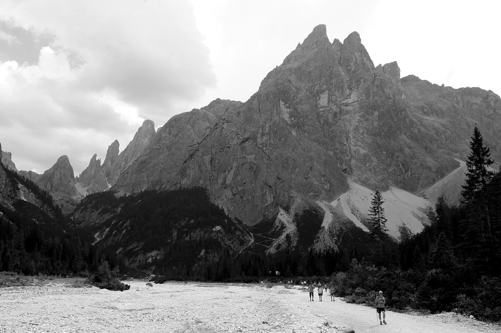
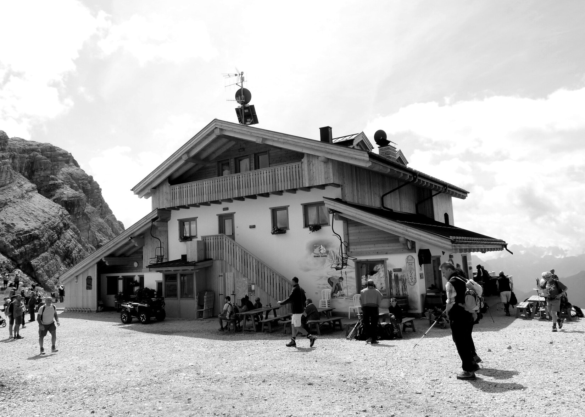
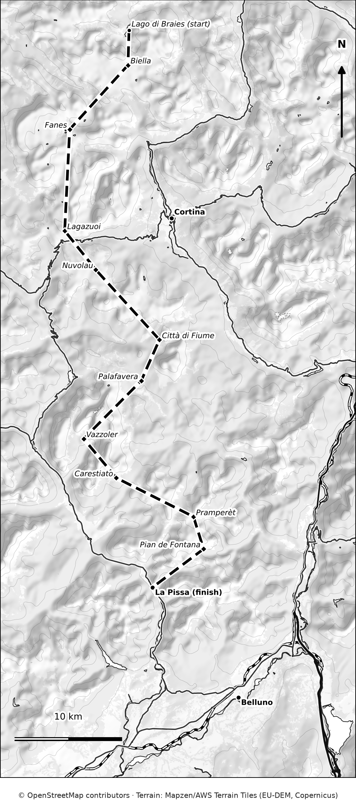

# PART 3: ACTIVITIES

# 13. Hiking and Mountain Huts

Walking is the main reason most people visit the Dolomites in summer. The trails are well marked, the huts serve real meals, and the lifts let you start high. But the range of difficulty is wide, and the most common problems are simple ones: starting too late, choosing a hike that is too hard, or arriving at a hut with no booking.

This chapter helps you pick the right walks, plan a hut stay, and avoid the usual mistakes.

## How to choose a hike

<!-- FIG:C13a -->

*Figure 13.1. Walkers on the wide valley path in Val Fiscalina, a gentle walk with big mountain views.*
<!-- /FIG -->

### The difficulty scale used in this book

| Level | What it means |
|---|---|
| **Easy** | Wide paths, little climbing, no exposure. Good for most people, including children. |
| **Moderate** | Longer, with real climbing and rough ground. You need decent fitness and good boots. |
| **Hard** | Long days, steep or exposed sections, cables or ladders. For experienced, fit walkers. |

### Italian grades you will see on signs and websites

| Grade | Meaning |
|---|---|
| **T** (turistico) | Easy walking on clear paths |
| **E** (escursionistico) | Marked mountain paths; some experience and good shoes needed |
| **EE** (escursionisti esperti) | Steeper, rougher or more exposed; sure-footedness and mountain experience needed |
| **EEA** (esperti con attrezzatura) | Via ferrata or protected routes; harness, helmet and lanyard required |

### Trail markings

Trails are marked with red and white stripes and a trail number. The number is on signposts at junctions. In South Tyrol, the province introduced a uniform marking system in 2019. Note the trail number before you set off, and check each junction.

## 20 hikes at a glance

Times and distances come from tourist boards and trail guides. They are for walking time only, not stops. Where a figure is not available, the table says "check".

| Hike (chapter) | Level | Distance and time | Ascent | Access |
|---|---|---|---|---|
| **Seceda ridge** (7) | Easy | 1.3 km, 30–45 min | 110 m | Seceda lifts |
| **Col Raiser to Seceda loop** (7) | Moderate | 9.7 km, about 4 h | 570 m | Col Raiser cable car |
| **Compatsch to Saltria** (7) | Easy | 6.8 km, about 2 h | 105 m | Alpe di Siusi |
| **Sciliar (Schlern)** (7) | Moderate to hard | 22.7 km circuit; about 3.5 h to the hut | 1,133 m | Alpe di Siusi |
| **Sassolungo circuit** (7) | Moderate to hard | 17.6 km, 6 h (about 8 with stops) | About 1,000 m | Passo Sella |
| **Adolf Munkel Weg** (Val di Funes) | Easy | 5–7 km, 3–4 h | 200–400 m | Val di Funes |
| **Piz Boè from Sass Pordoi** (8) | Moderate | 5.3 km, 2–3.5 h | 430 m | Passo Pordoi cable car |
| **Cinque Torri open-air museum** (9) | Easy | Short loops, half a day | Small | Chairlift |
| **Lagazuoi tunnels** (9) | Moderate to hard | About 3 h | Descending | Falzarego cable car |
| **Lago di Sorapis** (9) | Hard (exposed) | 10.5 km, about 4 h | 434 m | Passo Tre Croci |
| **Croda da Lago circuit** (9) | Moderate to hard | 12.8 km, 4.5–6 h | 900 m | Passo Giau area |
| **Lago Federa out and back** (9) | Moderate | 8.4 km, 2.5–3.5 h | 500 m | Passo Giau area |
| **Tre Cime loop** (10) | Easy to moderate | 9.5–10 km, 3.5–4 h | Moderate | Rifugio Auronzo |
| **Cadini di Misurina viewpoint** (10) | Moderate (exposed) | About 1.5 h round trip | Moderate | Rifugio Auronzo |
| **Monte Piana from Lake Antorno** (10) | Moderate | 3.9 km one way, about 2.5 h | 368 m | Lake Antorno |
| **Sesto to Rifugio Locatelli** (10) | Hard | 13.9 km, about 5 h | 953 m | Val Fiscalina |
| **Val Fiscalina circuit** (10) | Hard | 17.8 km, 6.5–8 h | 1,175 m | Sesto |
| **Gardeccia to Rifugio Re Alberto** (11) | Moderate | About 2 h from Gardeccia | Steep and rocky | Vajolet chairlift |
| **Lago di Braies lake path** (10) | Easy | About 1 h | Small | Braies |
| **Lago di Carezza lake path** (11) | Easy | 30–60 min | Small | Carezza |

> **Wish I'd Known:** Many of the best walks start at a lift, and the last lift down is the real deadline. Check the last descent time before you start, and add a margin of at least an hour.

## Hiking rules and good habits

**Starting and finishing**
- **Start early.** Aim to be on the trail by 08:00 or earlier in July and August. Thunderstorms often build in the afternoon.
- **Set a turnaround time.** If you are behind schedule at that time, turn back.
- **Tell someone.** Let your hotel or hut know your route and expected return time.

**On the trail**
- **Stay on marked paths.** Shortcuts cause erosion and can be dangerous.
- **Close gates** behind you and give grazing cows space. Do not feed animals.
- **Take your litter home.** Huts often cannot take your waste.
- **Respect private land.** Several famous viewpoints, such as Seceda and Santa Maddalena, have had access problems when visitors left the paths.
- **Dogs.** Keep them on a lead near livestock and check each lift's dog rules.

**What to carry**
- Sturdy hiking boots, a waterproof jacket, an insulating layer, hat and gloves, sun protection.
- Two litres of water, snacks and a first-aid kit.
- A paper map or offline map, and a charged phone.
- Cash for huts. Some do not take cards.
- Walking poles can protect your knees on long descents.

## Mountain huts (rifugi)

<!-- FIG:C13b -->

*Figure 13.2. A Dolomites mountain hut: Rifugio Averau, where walkers stop for lunch on the high paths near Nuvolau.*
<!-- /FIG -->

Huts are not hotels, but they are not camp stoves either. Most serve hot meals, drinks and coffee, and many offer beds. They are independently run or owned by alpine clubs such as the Club Alpino Italiano (CAI).

### Using huts for lunch

- Walk in. For popular huts, arrive before the midday rush.
- Menus often list set dishes and drinks separately.
- Expect higher prices than in the valley. Supplies come up by lift or helicopter.
- Carry cash in case the card machine fails.

### Sleeping in a hut

| Topic | What to know |
|---|---|
| **Cost** | About €60–110 per person per night with half board in 2026. On the Alta Via 1, estimates ran up to €130. |
| **Half board** | Dinner and breakfast. Drinks cost extra. |
| **Rooms** | Dormitories or small shared rooms. Private rooms are limited and sell out first. |
| **What to bring** | Sleeping bag liner, towel, indoor shoes, earplugs, headlamp, cash. |
| **Boots** | Not allowed indoors. There is usually a boot room. |
| **Payment** | Many huts accept cards now, but some do not. Carry cash for drinks and the balance. |
| **Arrival** | Arrive by late afternoon. Let the hut know if you will be late. |

### Booking huts

There is no central booking system. Each hut takes its own reservations, by website, email, phone or bank transfer.

| When | What to do |
|---|---|
| **August–September before** | Research your route and list your huts. |
| **October–December** | Early booking window. Private rooms sell out fast. |
| **January–March** | Many traditional and CAI huts open reservations. |
| **One to two months before** | Check again. Cancellations happen. |

- **Deposits.** Expect to pay about 20% to 50% by card or bank transfer. You pay the rest at the hut.
- **Slow replies.** In winter, huts may check email only every couple of weeks. Send your request early and be patient.
- **Cancellation.** Rules vary. Some huts allow free changes until 18:00 two days before, and may charge a no-show fee up to the full booked value. Cancel as soon as your plans change. Bad weather can be a valid reason if you can show it.
- **Print your confirmations** and keep them in a waterproof bag.

### Hut opening dates (examples from 2026)

| Hut | Dates |
|---|---|
| Rifugio Fondovalle (Val Fiscalina) | May to October |
| Rifugio Locatelli (Tre Cime) | June to September |
| Rifugio Forcella Pordoi | About 20 June to 30 September |
| Rifugio Cavazza al Pisciadù | About 21 June to 20 September |

Each hut sets its own dates, so confirm for 2027.

## The Alta Via 1 and shorter hut-to-hut routes

<!-- FIG:M14 -->

*Figure 13.3. The Alta Via 1 from Lago di Braies to La Pissa. The huts are joined by straight lines, so this shows the order of the stages, not the path of the trail.*
<!-- /FIG -->

### Alta Via 1 at a glance

| | |
|---|---|
| **What it is** | The Alta Via 1 is a hut-to-hut trek of about 125 km (some sources say 115 km) from Lago di Braies to La Pissa, near Belluno. |
| **Time** | 8 to 12 days is typical. |
| **Climbing** | About 7,300 m in total. |
| **Difficulty** | Moderate to challenging. Long ascents and descents, rocky ground, and some narrow or exposed sections with fixed cables. No mountaineering skills needed on the standard route. |
| **Season** | Mid-June to late September. June can have snow high up. July and August are busiest. September has fewer people and cooler nights. |
| **Huts on the route** | Biella, Fanes, Lagazuoi, Nuvolau, Città di Fiume, Palafavera, Vazzoler, Carestiato, Pramperét and Pian de Fontana. |
| **Cost** | Hut accommodation about €75 to €130 a night with half board, plus €20 to €25 a day for trail snacks (estimates). |
| **Getting there** | Buses 445 and 442 serve Lago di Braies from Cortina or Dobbiaco. The finish is near La Pissa, with a short bus ride to Belluno. |
| **Luggage** | No baggage transfer on the standard route. Plan to carry everything. |

### Shorter options

- **4 to 5 days:** the northern highlights of the Alta Via 1.
- **6 to 8 days:** shorter or faster sections.
- **Alta Badia High Route:** about 7 days, circular, for expert hikers (Chapter 8).
- **Single-hut stay:** one night at Rifugio Locatelli, Fondovalle, or a hut near the Vajolet Towers, combined with day walks.

## Guided or independent?

| Option | Good for | Cost guide |
|---|---|---|
| **Independent** | Confident walkers who like to plan | Hut prices, lifts and food only |
| **Self-guided package** | People who want bookings handled | Tour companies list 7-day tours from about US$1,372 and 8-day tours from about US$2,700 (2026 listings, including accommodation and meals) |
| **Guided group tour** | First-time trekkers who want a leader | Longer tours (12 days) were listed above US$5,000 |
| **Private mountain guide** | Exposed routes, via ferrata, bad weather decisions | Ask local guide offices for current day rates |

A good compromise is to walk independently on easy and moderate routes and hire a guide for the harder or more exposed days.

## Mistakes to avoid

- Starting after 10:00 in July or August.
- Choosing a hike by the photo, not by the grade.
- Forgetting the last lift down.
- Arriving at a hut with no booking.
- Carrying no cash.
- Underestimating the cold above 2,500 m, even in summer.
- Wearing trainers on rocky or wet ground.

## What to do next

1. Pick two or three hikes from the table that match your level.
2. For a hut stay or the Alta Via 1, start booking in the autumn before your trip.
3. Continue to Chapter 14 for via ferrata, cycling and other activities.
