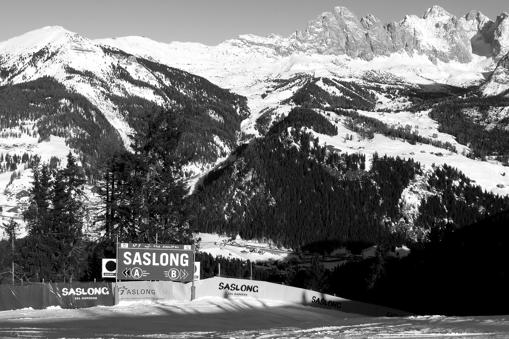
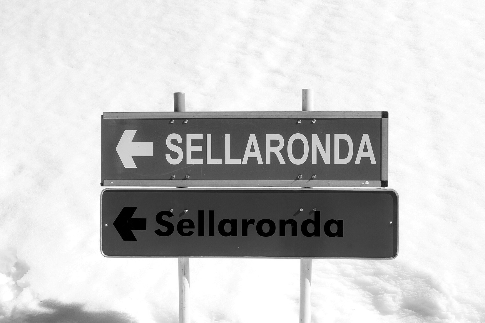
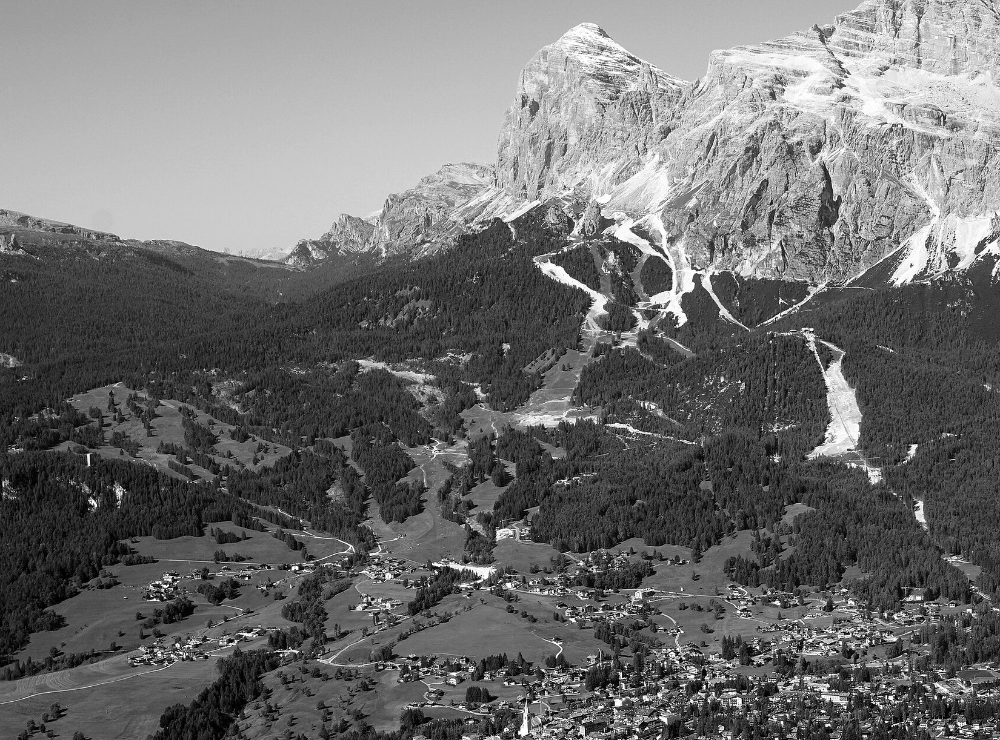
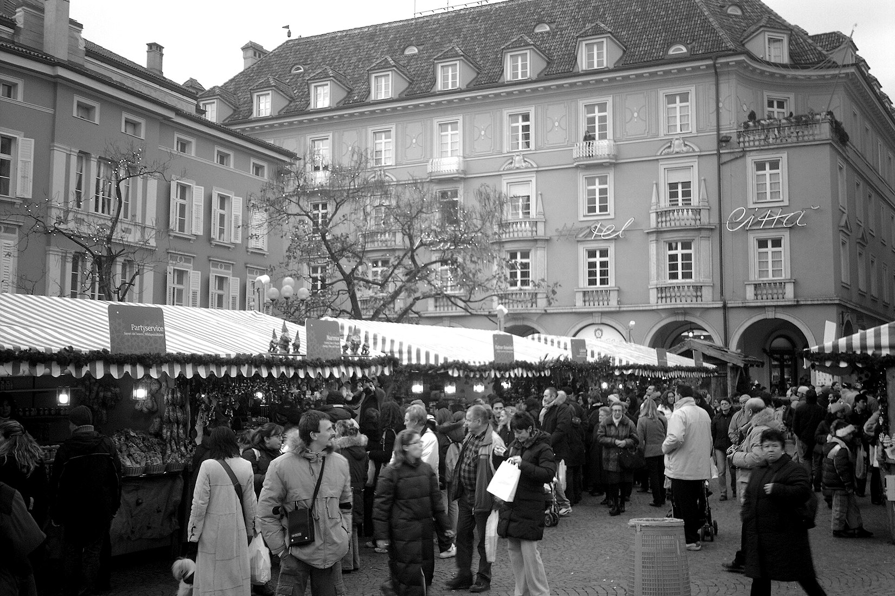

# 15. Winter in the Dolomites

Winter in the Dolomites means one thing for most visitors: the Dolomiti Superski network, one of the largest ski areas in the world, linked by a single lift pass. It also means Christmas markets, spa hotels, sledging and snowshoe walks for people who do not ski.

This chapter explains how the pass works, which resort suits which skier, how to ski the Sella Ronda without getting stuck, and what non-skiers can do.

> **Important:** Prices and dates here are the **2026/27 winter** figures reported by tourist boards and ski-area sites before the season began. The official Dolomiti Superski site was not available to check directly, so verify the figures before you book.

## Dolomiti Superski explained

<!-- FIG:C15a -->

*Figure 15.1. The Saslong run in Val Gardena, with the snow-covered Dolomites behind.*
<!-- /FIG -->

| | |
|---|---|
| **What it is** | A group of 12 ski areas linked by one pass. |
| **Size** | About 1,200 km of pistes (reported as 1,246 km) and about 450 lifts. |
| **Season (2026/27, reported)** | About 28 November 2026 to 11 April 2027. Individual areas open and close on their own dates. Cortina's season was reported to start on 30 November. |
| **One pass** | The Dolomiti Superski pass works across all 12 areas. Local passes (such as Superskirama, with 8 areas) are cheaper but cover less. |

### Lift pass prices, 2026/27 (adult, reported)

| Pass | Price |
|---|---|
| **1 day, high season** | About €89 |
| **6 days, high season** | About €453 |
| **Season pass (advance sale)** | About €990, rising to about €1,060 from 25 December |
| **Family pass (per day)** | About €43 |
| **Low season** | Lower. A 1-day adult pass was €77 in 2025/26. |

**Seasons for pricing.** Low season is reported from the opening to 19 December 2026, and again from 15 March 2027 to the end of the season. High season runs from 20 December to 14 March. Check the official tables.

> **Wish I'd Known:** Prices rise and fall by date. Skiing a week in early December or late March can cost noticeably less than a week in February.

### New for 2026/27 (reported)

- Plan de Corones: a new 10-seat gondola ("Kronplatz 1+2") and new slopes.
- 3 Zinnen: a new "Helmissimo" gondola at Versciaco.
- Val di Fassa and Val di Fiemme: a new gondola at Buffaure and a new chairlift at Obereggen.
- Alpe di Siusi: a new chairlift.
- Alta Badia: a new slope in the Arlara area.
- Total investment of about €100 million in lifts, snowmaking and renewable energy was reported.

## Which resort for which skier?

| Area | Size (reported) | Best for |
|---|---|---|
| **Val Gardena** | About 181 km | Mixed groups. Easy to expert, with the Saslong World Cup run (3.4 km, about 800 m drop). |
| **Alta Badia** | About 130 km | Beginners and intermediates; fine dining; gentle cruising. |
| **Kronplatz (Plan de Corones)** | About 125 km | Families and beginners (many red and blue runs); experts have the "Black Five". |
| **Cortina d'Ampezzo** | About 120 km | Scenery and Olympic history. The Olimpia delle Tofane run is open to all skiers in 2026/27. |
| **Arabba / Marmolada** | About 63 km | Experts and steeper terrain. |
| **Val di Fassa** | About 55 km | Access to the Sella Ronda and Marmolada from a quieter valley. |
| **Alpe di Siusi** | Smaller | Beginners and families; gentle, open slopes. |

**Beginners and families.** Alta Badia, Kronplatz and the Alpe di Siusi have good nursery slopes. **Experts.** Val Gardena, Arabba and Kronplatz offer the steeper runs. **Mixed groups.** Val Gardena or Alta Badia.

## The Sella Ronda ski circuit

<!-- FIG:C15b -->

*Figure 15.2. Sellaronda signs. Orange marks the clockwise direction and green the counter-clockwise one.*
<!-- /FIG -->

| At a glance | |
|---|---|
| **Overview** | A ski circuit around the Sella massif over four passes, linking Val Gardena, Alta Badia, Arabba and Val di Fassa. |
| **Length** | About 44 km, with about 23 km of pistes and the rest by lift. |
| **Difficulty** | Easy to intermediate. It needs a good level of fitness. |
| **Time** | About 6 hours with breaks and lifts. |
| **Pass needed** | The Dolomiti Superski pass. |
| **Directions** | **Clockwise (orange signs):** Selva to Passo Gardena, Corvara, Campolongo, Arabba, Pordoi, Lupo Bianco, Sella. **Counter-clockwise (green signs):** the reverse. The green direction is slightly easier. |
| **Timing** | Start before 10:00. Cross the last pass before about 15:30, so lifts do not close on you. |
| **Practical tips** | Pick one direction and follow its signs. Check the weather and lift status in the morning. Start from Selva or Corvara. |
| **Common mistakes** | Starting late. Skiing in poor visibility. Not leaving time for the last lifts. |
| **Drawbacks** | A long day. Lifts close on a fixed schedule, and a late finish can mean a taxi or bus back. |

## Cortina after the Olympics

<!-- FIG:C15e -->

*Figure 15.3. The Olimpia delle Tofane ski race course above Cortina, seen in summer as a cleared strip on the slope.*
<!-- /FIG -->

- **Season.** Reported to open on 30 November 2026.
- **Prices.** An adult day ticket was reported at €80 in the main season for 2026/27, with 120 km of slopes and 25 lifts.
- **New lifts.** A new gondola linking the Tofane and Cinque Torri areas was planned. Check whether it is open before you rely on it. A related Olympic cable-car project was under investigation in 2026.
- **World Cup.** The women's World Cup races on the Olimpia delle Tofane are scheduled for **15 to 17 January 2027**. Expect road closures to non-residents, very limited parking and a free Dolomiti Bus shuttle on race days. Hotels fill early.

## Ski lessons and rental

- **Private lessons.** From about €60 an hour or €360 to €420 a day for adults in Alta Badia and Val Gardena (2026 listings).
- **Group lessons.** Cheaper. Ask the local ski school for prices.
- **Rental.** Prices were not available in the sources checked. Book online in advance for peak weeks, and compare shops near the lifts.

## For non-skiers

<!-- FIG:C15c -->

*Figure 15.4. The Christmas market (Christkindlmarkt) in Bolzano, with stalls under red-and-white awnings.*
<!-- /FIG -->

| Activity | Where | Notes |
|---|---|---|
| **Christmas markets** | Bolzano, Brixen, Merano, Brunico | 2026 dates: 27 November to 6 January. Opening evenings on 26 or 27 November. |
| **Local markets** | Ortisei (28 November to 6 January); Selva (29 November to 3 January) | 2026 dates |
| **Toboggan run** | Rasciesa to Ortisei | About 4.9 km. One of the best in South Tyrol. |
| **Winter walks and snowshoeing** | Alpe di Siusi | About 60 km of marked winter trails. Cable car about €30 round trip (2026). |
| **Lifts for pedestrians** | Ortisei, Seceda area, Col Raiser, Ciampinoi, Dantercepies | Check which lifts sell pedestrian tickets. |
| **Spas** | Most villages | A day pass may cost about €68 on weekdays (2026 example). |

## Winter driving and arriving

- **Winter tyres or chains.** Compulsory on the Brenner motorway and in Bolzano from 15 November to 15 April. Required in winter conditions elsewhere in South Tyrol. Chapter 4 has details.
- **Transfers.** Private or shared airport transfers save time. Book ahead for peak weekends.
- **Ski bus.** Local ski buses run in many resorts. Check times.

## Crowds and prices by period

| Period | Crowds | Prices |
|---|---|---|
| Early December | Low to medium | Low season |
| Christmas and New Year | Very high | Highest |
| January | Medium | Medium |
| February | High, especially school holidays | High |
| March | Medium to high. Easter Sunday 2027 is 28 March, so expect a busy week around it. | Medium; low season from 15 March (reported) |

## Common mistakes

- Booking in Christmas week without checking prices.
- Buying a local pass and then wanting to ski the Sella Ronda.
- Starting the Sella Ronda after 11:00.
- Driving a rental car without winter equipment.
- Planning a World Cup week stay without booking early.

## What to do next

1. Choose your resort by skill level, using the table above.
2. Check official 2026/27 pass prices and your resort's opening date.
3. Book hotels well ahead for Christmas, February and race weeks.
4. Continue to Chapter 16 for food and drink.
